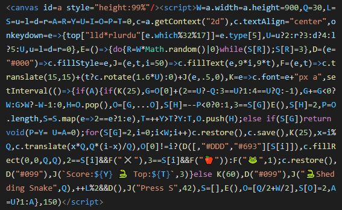

# Shedding Snake js1024

Shedding Snake is a contribution to [js1024](https://js1024.fun/), an annual javascript golfing competition with a max size of 1kb (1024 bytes), no shim category. The minfied build is exactly 1024b.

*Entire code base of 1024 bytes:*

## About

Eat apples to grow and shed your skin. Avoid colliding with yourself or skin waste or you'll die. Try to beat the hiscore! Can you reach 25?
Controls: WASD or Arrow keys.

## Features that ate bytes

1024 is actually more than enough for a snake game. The extra bytes went into: The snake shed it skin each time it grows. Rotate snake face to current direction. Title screen. Skin pattern. Emojis :-). Score and hiscore.

## How to run

Open the html-file in a modern browser. You can probably just double click it.

## How to build

The script is minified in three steps (too lazy to make a build script):

1. Custom node script
   Run `node shorten-stuff.js` in the src folder.
2. [Terser online](https://xem.github.io/terser-online/)
   Paste the generated `shortened-script.js` into terser.
3. [Uglify online](https://skalman.github.io/UglifyJS-online/)
   Paste the result from terser into uglifyjs.

Create a html `<canvas id=a/>` to get an 1kb html-file. Add `<meta charset="UTF-8" />` at top or the emojis will look strange (js1024.fun site already have this meta tag).
